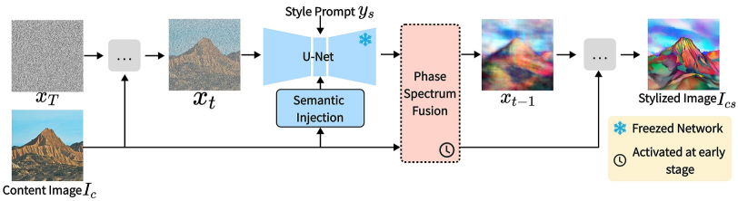

<div id="top"></div>
<!--
*** Thanks for checking out the Best-README-Template. If you have a suggestion
*** that would make this better, please fork the repo and create a pull request
*** or simply open an issue with the tag "enhancement".
*** Don't forget to give the project a star!
*** Thanks again! Now go create something AMAZING! :D
-->


<!-- PROJECT SHIELDS -->
<!--
*** I'm using markdown "reference style" links for readability.
*** Reference links are enclosed in brackets [ ] instead of parentheses ( ).
*** See the bottom of this document for the declaration of the reference variables
*** for contributors-url, forks-url, etc. This is an optional, concise syntax you may use.
*** https://www.markdownguide.org/basic-syntax/#reference-style-links
-->
<!-- [![Contributors][contributors-shield]][contributors-url]
[![Forks][forks-shield]][forks-url]
[![Stargazers][stars-shield]][stars-url]
[![Issues][issues-shield]][issues-url]
[![MIT License][license-shield]][license-url]
[![LinkedIn][linkedin-shield]][linkedin-url] -->


<!-- PROJECT LOGO -->
<br />
<!-- <div align="center">
  <a href="https://github.com/othneildrew/Best-README-Template">
    
  </a>

  <h3 align="center">Best-README-Template</h3>

  <p align="center">
    An awesome README template to jumpstart your projects!
    <br />
    <a href="https://github.com/othneildrew/Best-README-Template"><strong>Explore the docs »</strong></a>
    <br />
    <br />
    <a href="https://github.com/othneildrew/Best-README-Template">View Demo</a>
    ·
    <a href="https://github.com/othneildrew/Best-README-Template/issues">Report Bug</a>
    ·
    <a href="https://github.com/othneildrew/Best-README-Template/issues">Request Feature</a>
  </p>
</div> -->


<!-- TABLE OF CONTENTS -->
<!-- <details>
  <summary>Table of Contents</summary>
  <ol>
    <li>
      <a href="#about-the-project">CAST</a>
      <ul>
        <li><a href="#built-with">Built With</a></li>
      </ul>
    </li>
    <li>
      <a href="#getting-started">Getting Started</a>
      <ul>
        <li><a href="#prerequisites">Prerequisites</a></li>
        <li><a href="#installation">Installation</a></li>
      </ul>
    </li>
    <li><a href="#usage">Usage</a></li>
    <li><a href="#roadmap">Roadmap</a></li>
    <li><a href="#contributing">Contributing</a></li>
    <li><a href="#license">License</a></li>
    <li><a href="#contact">Contact</a></li>
    <li><a href="#acknowledgments">Acknowledgments</a></li>
  </ol>
</details> -->


<!-- ABOUT THE PROJECT -->
# Training-free Fourier Phase Diffusion for Style Transfer 
For details see the [our paper](https://ijcai-preprints.s3.us-west-1.amazonaws.com/2025/2173.pdf) 


## Abstract
 Diffusion models have shown significant potential for image style transfer tasks. However, achieving effective stylization while preserving content in a training-free setting remains a challenging issue due to the tightly coupled representation space and inherent randomness of the models. In this paper, we propose a Fourier phase diffusion model that addresses this challenge. Given that the Fourier phase spectrum encodes an image's edge structures, we propose modulating the intermediate diffusion samples with the Fourier phase of a content image to conditionally guide the diffusion process. This ensures content retention while fully utilizing the diffusion model's style generation capabilities. To implement this, we introduce a content phase spectrum incorporation method that aligns with the characteristics of the diffusion process, preventing interference with generative stylization. To further enhance content preservation, we integrate homomorphic semantic features extracted from the content image at each diffusion stage. Extensive experimental results demonstrate that our method outperforms state-of-the-art models in both content preservation and stylization.


## 🔥 Updates
- 2025.09: Our code is released!
- 2025.05: Some results of our approach. The code is coming.

<!-- GETTING STARTED -->
## 💡 Quickstart

  ```sh
  conda create -n PhaseDiff python==3.8.18
  conda activate PhaseDiff
  pip install torch

  cd diffusers
  pip install -e .
  pip install torchsde -i https://pypi.tuna.tsinghua.edu.cn/simple
  cd ../diffusers_test
  pip install transformers
  pip install accelerate
  ```

### Download Pre-trained SDXL files
Download the [SDXL](https://huggingface.co/stabilityai/stable-diffusion-xl-base-1.0/tree/main).
<p align="right">(<a href="#top">back to top</a>)</p>

## 💻  Run Demo    

### GPU Memory
All experiments are conducted on a single RTX 3090 GPU. About 17 GB. 

### Run
We provide two scripts to run our method.
```sh
cd ./diffusers_test
python stable_diffusion_xl_test.py \
  --refimgpath ./ContentImages/final_img/yuantu/3.png \
  --model_name <SDXL folder> \# PhaseDiffusion/stable-diffusion-xl-base-1.0
  --unet_name  <Unet subfolder in SDXL folder> \# PhaseDiffusion/stable-diffusion-xl-base-1.0/unet
  --prompt_json  ./style_prompt1.json  \#style text description
  --num_images_per_prompt  1 \
  --output_dir ./output0 \
  --sampler  "DDIM"  \
  --step  30  \
  --cfg  7.5 \
  --height 1024 \
  --width 1024  \
  --seed 123456789  \
  --n 160  \
  --b 1.8  \
  --s 1   \
  --t 20 \
  --use_cnt_mid_feat_in_unet \
  --is_adain_during_replace_phase \
  --phase_fusion_steps 2 5 8 \
  --fusion_alpha 0.5 \
  --fusion_beta 0.7 \
```
>❗You can manually adjust the *phase_fusion_steps*, *fusion_alpha* and *fusion_beta* parameters, if you encounter bad results

or 
```sh
cd ./diffusers_test
bash run.sh
```
#### Parameter Interpretation
```sh
--refimgpath                      Path to Content Images
--model_name                      SDXL saved path
--unet_name                       Path to unet folder in SDXL
--prompt_json                     JSON file for style prompts
--num_images_per_prompt           how many images are generated for each image and style
--output_dir                      Path to save stylized images
--n                               hyperparameter n∈[160,320,640,1280] 
--b                               hyperparameter b∈(1,3) 
--s                               hyperparameter s∈（1,2）
--use_cnt_mid_feat_in_unet        use Semantic injection 
--is_adain_during_replace_phase   use AdaIN in Phase Fusion module
--phase_fusion_steps 2 5 8        Activation of Phase Fusion module
--fusion_alpha                    Residual coefficient    
--fusion_beta                     Residual coefficient
```

#### Parameter Recommendation
Parameter of [Freeu](https://github.com/ChenyangSi/FreeU)

1. We recommend setting the parameters as: **n=160, b=2.5, s=1**.

2. When the expression of style information is ambiguous, please reduce b (increase s).

3. When the expression of content information is unclear, please increase b (decrease s).

#### ⭐️⭐️⭐️ Phase fusion module in Diffusion

When the content is not well preserved or style artifacts appear, you can manually adjust the *phase_fusion_steps* parameter and *fusion_alpha / fusion_beta* parameters.

<p align="right">(<a href="#top">back to top</a>)</p>

##  📑 Citation
```sh
Need to update, please wait.
```
<p align="right">(<a href="#top">back to top</a>)</p>


## 🤝 Acknowledgement
Our code is built upon the repositories of [diffusers](https://github.com/huggingface/diffusers) and [FreeStyle](https://github.com/FreeStyleFreeLunch/FreeStyle). Thank their authors for their excellent work.


[contributors-shield]: https://img.shields.io/github/contributors/othneildrew/Best-README-Template.svg?style=for-the-badge
[contributors-url]: https://github.com/othneildrew/Best-README-Template/graphs/contributors
[forks-shield]: https://img.shields.io/github/forks/othneildrew/Best-README-Template.svg?style=for-the-badge
[forks-url]: https://github.com/othneildrew/Best-README-Template/network/members
[stars-shield]: https://img.shields.io/github/stars/othneildrew/Best-README-Template.svg?style=for-the-badge
[stars-url]: https://github.com/othneildrew/Best-README-Template/stargazers
[issues-shield]: https://img.shields.io/github/issues/othneildrew/Best-README-Template.svg?style=for-the-badge
[issues-url]: https://github.com/othneildrew/Best-README-Template/issues
[license-shield]: https://img.shields.io/github/license/othneildrew/Best-README-Template.svg?style=for-the-badge
[license-url]: https://github.com/othneildrew/Best-README-Template/blob/master/LICENSE.txt
[linkedin-shield]: https://img.shields.io/badge/-LinkedIn-black.svg?style=for-the-badge&logo=linkedin&colorB=555
[linkedin-url]: https://linkedin.com/in/othneildrew
[product-screenshot]: images/screenshot.png
